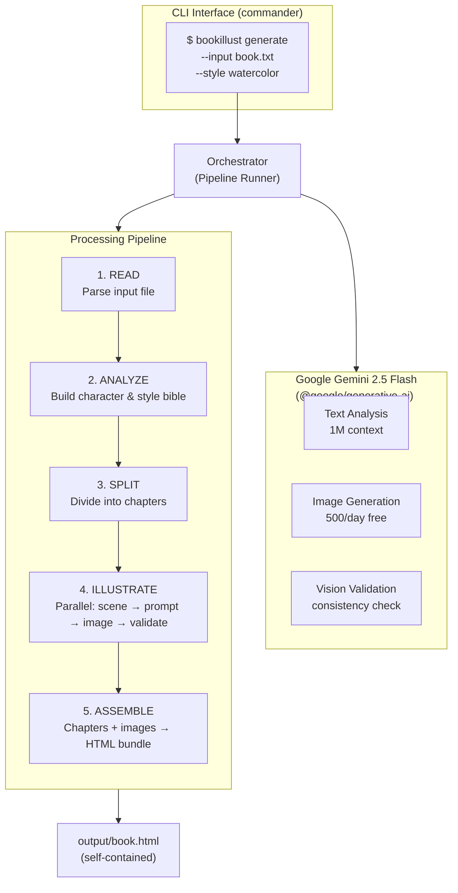
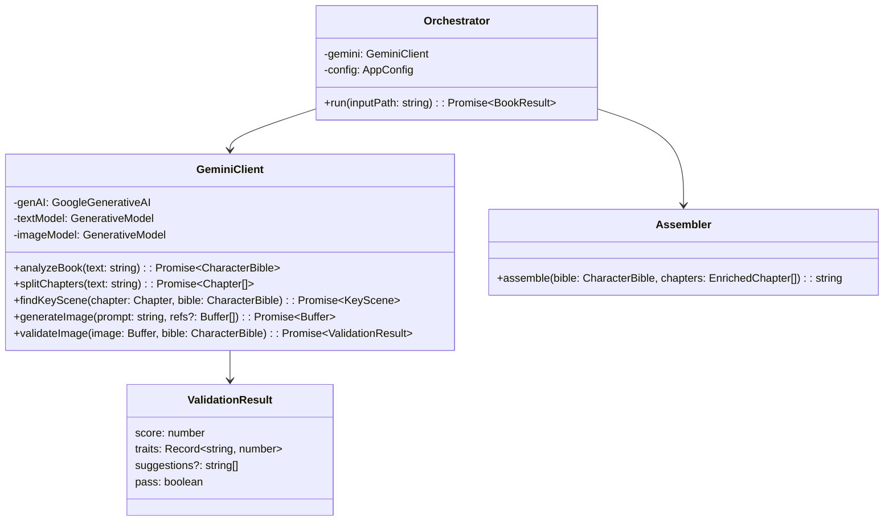
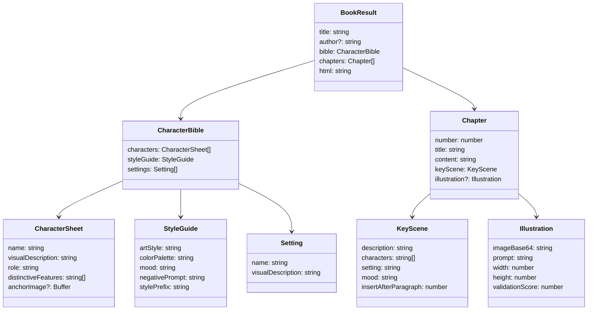
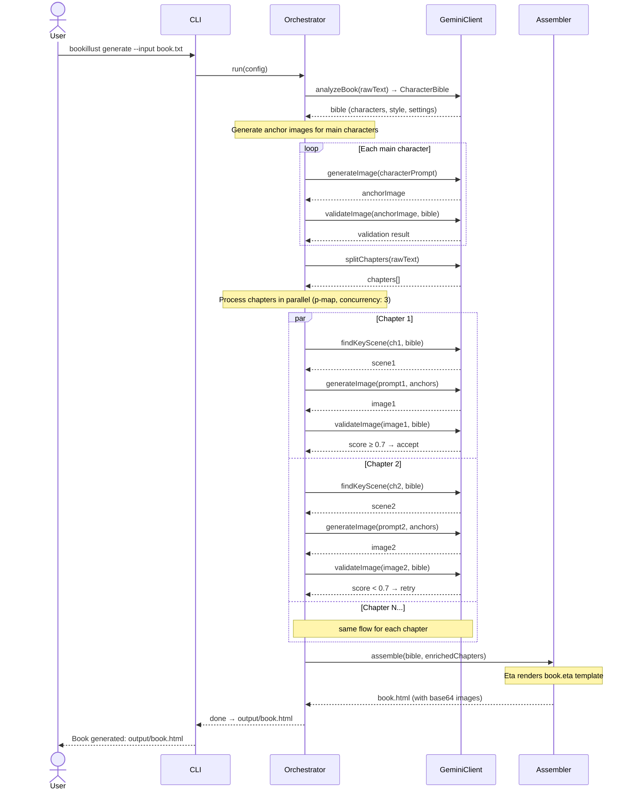

# Application Architecture — Illustrated Book Generator

> **Decision: Gemini-only MVP.** No provider abstraction layer. See [decisions.md](./decisions.md) for all ADRs.

## System Overview



---

## Pipeline Detail

```mermaid
flowchart LR
    subgraph Stage1["Stage 1: Read"]
        INPUT["book.txt"] --> READER["BookReader<br/>(fs.readFile)"]
        READER --> RAW["Raw Text"]
    end

    subgraph Stage2["Stage 2: Analyze"]
        RAW --> LLM1["Gemini: Analyze full text<br/>(structured output → zod)"]
        LLM1 --> BIBLE["Character Bible<br/>+ Style Guide"]
    end

    subgraph Stage3["Stage 3: Split"]
        RAW --> LLM2["Gemini: Split chapters<br/>(structured output → zod)"]
        LLM2 --> CHAPTERS["Chapter[]"]
    end

    subgraph Stage4["Stage 4: Illustrate (parallel via p-map)"]
        CHAPTERS --> PAR{{"p-map<br/>concurrency: 3"}}
        BIBLE --> PROMPT_BUILD["Build Prompt"]
        PAR --> LLM3["Gemini: Find key scene"]
        LLM3 --> PROMPT_BUILD
        PROMPT_BUILD --> IMG_GEN["Gemini Flash Image:<br/>Generate with anchor ref"]
        IMG_GEN --> VALIDATE["Gemini Vision:<br/>Validate consistency"]
        VALIDATE -->|Pass| OPTIMIZE["jimp: resize + compress"]
        VALIDATE -->|Fail, retry ≤ 2| PROMPT_BUILD
        OPTIMIZE --> ENRICHED["Enriched Chapter<br/>(text + base64 image)"]
    end

    subgraph Stage5["Stage 5: Assemble"]
        ENRICHED --> TEMPLATE["Eta Template Engine"]
        TEMPLATE --> BUNDLE["book.html<br/>with ToC + embedded images"]
    end
```



---

## Gemini Integration (Direct, No Abstraction)

Since the MVP uses Gemini exclusively, there is no provider interface. The Gemini SDK is used directly in pipeline modules.



---

## Data Models



---

## Tech Stack

| Component | Technology | Package | Why |
|---|---|---|---|
| Language | TypeScript + Node.js | `typescript` | Requirement. Strong async/parallel. |
| AI (all operations) | Google Gemini 2.5 Flash | `@google/generative-ai` | Free. Text + image + vision in one SDK. |
| CLI Framework | commander | `commander` | Industry standard. 25M+ downloads/week. |
| CLI UX | ora + chalk | `ora`, `chalk` | Spinners & colored progress output. |
| Schema Validation | zod | `zod` | Gemini structured output integration. |
| HTML Templating | Eta | `eta` | TypeScript-native, fastest engine. |
| Image Processing | jimp | `jimp` | Pure JS, zero native deps. |
| Concurrency | p-map | `p-map` | Map over chapters with concurrency limit. |
| Env Config | dotenv | `dotenv` | Load `.env` file. |
| Build | tsup | `tsup` | esbuild-powered, sub-100ms builds. |
| Dev Runner | tsx | `tsx` | Run `.ts` directly during development. |
| Linter / Formatter | Biome | `@biomejs/biome` | Already configured. 10-25x faster than ESLint. |
| Package Manager | npm | (built-in) | Ships with Node.js. Zero setup. |

---

## Project Structure

```
bookillust/
├── src/
│   ├── index.ts                  # CLI entry point (commander)
│   ├── gemini.ts                 # GeminiClient — all AI operations
│   ├── pipeline/
│   │   ├── orchestrator.ts       # Main pipeline runner
│   │   ├── reader.ts             # Read + normalize .txt files
│   │   ├── analyzer.ts           # Bible generation (uses gemini.ts)
│   │   ├── splitter.ts           # Chapter splitting (uses gemini.ts)
│   │   ├── illustrator.ts        # Scene → prompt → image → validate
│   │   └── assembler.ts          # Eta template → HTML bundle
│   ├── templates/
│   │   └── book.eta              # HTML book template
│   ├── schemas.ts                # Zod schemas for all data models
│   └── config.ts                 # Configuration & env vars
├── .env.example                  # Template for GEMINI_API_KEY
├── biome.json                    # Biome linter/formatter config
├── package.json
├── tsconfig.json
└── tsup.config.ts
```

Key differences from the original multi-provider design:

- **No `providers/` directory** — Gemini is used directly via `gemini.ts`
- **No interfaces** — no `TextAIProvider`, no `ImageProvider`. Direct SDK calls.
- **`schemas.ts`** — centralized Zod schemas (was `types.ts`)
- **`book.eta`** — Eta template (was `book.html.ejs`)
- **Simpler, flatter structure** — fewer files, fewer abstractions

---

## Sequence: Main Pipeline Execution



---

## CLI Interface Design

```
USAGE
  $ bookillust generate [OPTIONS]

OPTIONS
  -i, --input <path>        Path to input text file (required)
  -o, --output <path>       Output directory (default: ./output)
  -s, --style <style>       Art style: watercolor | comic | realistic | anime (default: watercolor)
  --concurrency <n>         Parallel chapter processing limit (default: 3)
  --no-cache                Disable caching of intermediate results
  --verbose                 Show detailed progress logs

EXAMPLES
  $ bookillust generate -i story.txt
  $ bookillust generate -i novel.txt -s comic
  $ bookillust generate -i book.txt -o ./my-book --concurrency 5
```

Note: `--text-provider` and `--image-provider` flags are removed from MVP. They will be added in Phase 5 when alternative providers are implemented.

---

## Configuration

```
# .env file — only one API key needed for MVP
GEMINI_API_KEY=              # Google AI Studio API key (free, no credit card)

# Optional defaults
DEFAULT_STYLE=watercolor     # Art style preset
DEFAULT_CONCURRENCY=3        # Parallel chapter limit
```
