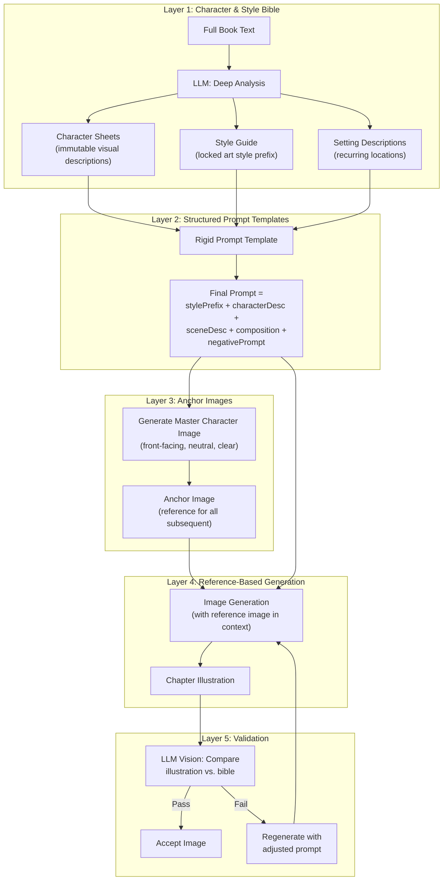
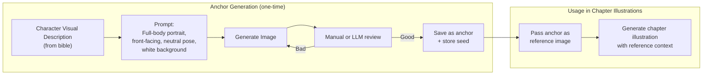
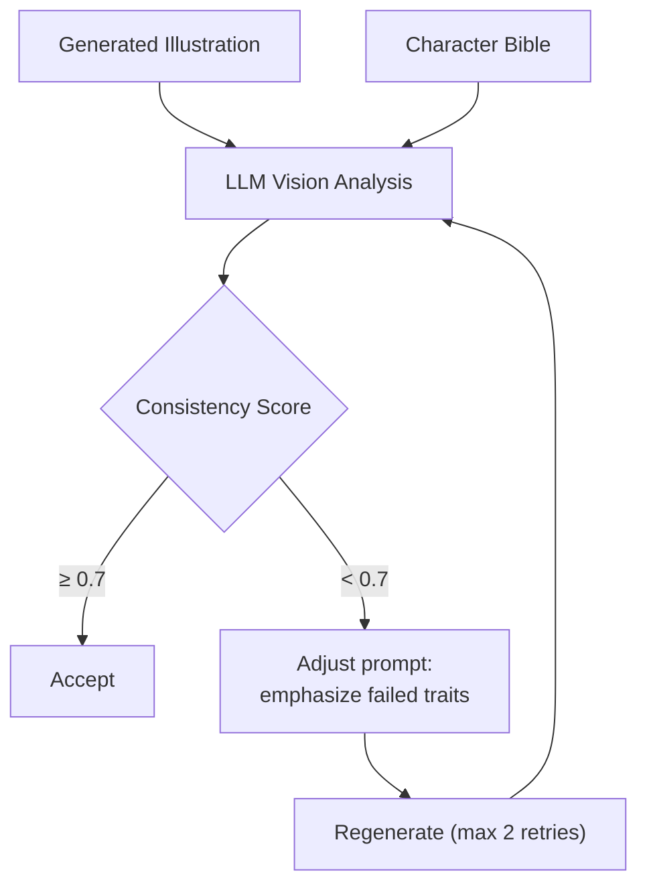
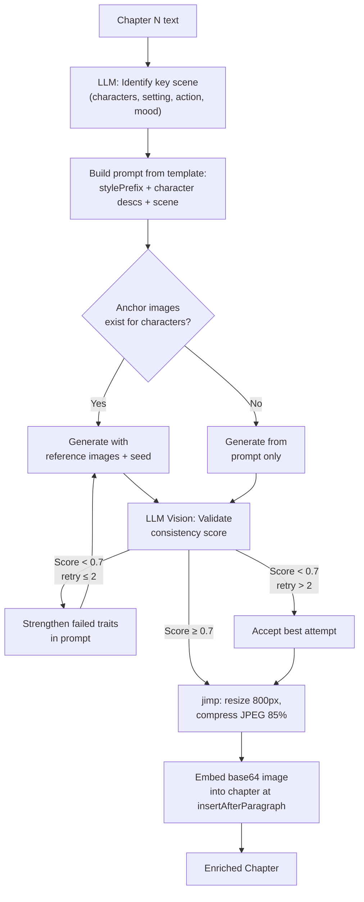

# Character Consistency Strategy

> The hardest problem in the entire project. This document describes a multi-layered approach using multimodal AI via OpenRouter.
>
> **Decision: Validation enabled by default.** See [decisions.md](./decisions.md) ADR-002.

## The Problem

AI image generators produce each illustration independently. When generating page-by-page, the model naturally varies facial features, clothing, proportions, and color palette. A character with "curly red hair" in Chapter 1 might get straight auburn hair in Chapter 5.

Even with all techniques combined, expect **~80–90% visual consistency** on free-tier models. For professional-grade results, FLUX.2 with LoRA fine-tuning is the gold standard but requires paid compute.

---

## Consistency Layers



---

## Layer 1: Character & Style Bible

Before generating any images, the LLM analyzes the full book text and produces a structured "bible." This is the single source of truth for all visual descriptions.

### Character Sheet Schema

```typescript
interface CharacterSheet {
  name: string;
  age: string;                    // "mid-20s", "elderly", "child ~8 years"
  gender: string;
  build: string;                  // "slim", "stocky", "athletic"
  height: string;                 // "tall", "average", "short"
  skinTone: string;               // specific: "warm olive", "pale with freckles"
  hairColor: string;              // "dark auburn curly hair, shoulder-length"
  hairStyle: string;              // "tied in a loose braid"
  eyeColor: string;               // "bright green"
  facialFeatures: string;         // "sharp jawline, small nose, light freckles"
  clothing: string;               // "blue pinafore dress, brown leather boots"
  accessories: string[];          // ["silver pendant necklace", "worn leather satchel"]
  distinctiveFeatures: string[];  // ["scar on left cheek", "always carries a lantern"]
  role: string;                   // "protagonist", "mentor", "antagonist"
}
```

### Style Guide Schema

```typescript
interface StyleGuide {
  artStyle: string;        // "digital watercolor illustration"
  colorPalette: string;    // "warm earth tones with muted greens and golds"
  mood: string;            // "whimsical, slightly melancholic"
  lighting: string;        // "soft diffused natural light"
  lineWork: string;        // "clean outlines with soft edges"
  negativePrompt: string;  // "photorealistic, 3D render, anime, extra limbs..."
  stylePrefix: string;     // concatenated locked prefix for all prompts
}
```

### LLM Prompt for Bible Generation

The bible generation prompt instructs the LLM to:

1. Read the entire book text
2. Identify all named characters with speaking roles or physical descriptions
3. Infer visual details not explicitly stated (era-appropriate clothing, setting-consistent features)
4. Choose a single art style that fits the book's genre and tone
5. Output structured JSON matching the Zod schema

---

## Layer 2: Structured Prompt Templates

Every illustration prompt follows a rigid template. The key principle: **copy-paste, never retype.** Even small phrasing changes shift the output.

### Template Structure

```
{styleGuide.stylePrefix}.
{characterSheet.visualDescription}.
{sceneDescription}.
{composition and camera angle}.
{styleGuide.negativePrompt}
```

### Example Generated Prompt

```
Digital watercolor illustration, warm earth tones, soft diffused light,
clean outlines with soft edges.

A young woman in her mid-20s with dark auburn curly shoulder-length hair
tied in a loose braid, bright green eyes, pale skin with light freckles,
sharp jawline, small nose, wearing a blue pinafore dress and brown leather
boots, silver pendant necklace, carrying a worn leather satchel.

She stands at the edge of a dark pine forest at dusk, looking back over
her shoulder toward a small cottage with glowing windows in the distance.
Fallen leaves cover the ground. Mist curls between the tree trunks.

Medium shot, slight low angle, golden hour lighting from the left.

--no photorealistic, 3D render, anime, manga, color shift, changing
clothes, mutated proportions, different art style, extra limbs, bad
anatomy, blurry, low quality
```

---

## Layer 3: Anchor Images



For each main character:
1. Generate a "master" reference image: front-facing, neutral pose, clear lighting, white or simple background
2. Save the image buffer and the seed number (if the API returns one)
3. For all subsequent illustrations featuring that character, pass the anchor image as a reference input

With **OpenRouter's multimodal API**, you include the anchor image directly in the prompt context alongside the text prompt — the model "sees" the reference while generating.

---

## Layer 4: Seed Consistency

The image model does not currently expose seed control. However, OpenRouter's multimodal API allows passing anchor images directly in the prompt context — the model "sees" the reference alongside the text prompt, which serves a similar stabilizing purpose.

If provider abstraction is added in Phase 5, seed reuse can be enabled for FLUX.2 and Stable Diffusion APIs which do support it.

```typescript
// Pass anchor image in multimodal prompt via OpenRouter
const result = await client.generateImage(chapterPrompt, [anchorImage]);
// The model uses the anchor as visual context for consistency
```

---

## Layer 5: Post-processing Validation

**Enabled by default** (ADR-002). Uses vision capability via OpenRouter to evaluate generated illustrations against the character bible.



### Validation Prompt

```
Compare this illustration against the character description below.
Score each trait 0-1 for visual match. Return JSON.

Character: {characterSheet}

Score these traits:
- hair_color_match
- hair_style_match
- clothing_match
- body_type_match
- distinctive_features_match
- art_style_match
- overall_consistency

If overall < 0.7, suggest specific prompt adjustments.
```

---

## Combining All Layers: Full Flow per Chapter



---

## Realistic Expectations

| Technique | Consistency Improvement | Cost | Complexity |
|---|---|---|---|
| Character bible + locked prompts | +40% baseline | Free | Low |
| OpenRouter multimodal anchor refs | +20% additional | Free | Medium |
| LLM validation + retry (default ON) | +5-10% additional | Free | Medium |
| **Combined MVP approach** | **~80-90%** | **Free** | **Medium** |
| LoRA fine-tuning (Phase 5: FLUX.2) | ~95-98% | Paid | High |

The OpenRouter-based approach delivers good results for storytelling purposes. Readers will recognize characters across chapters. For commercial-grade children's books or graphic novels, the FLUX.2 + LoRA path (Phase 5) is worth the investment.
