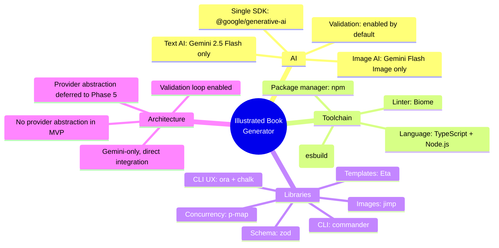

# Architecture Decision Record

> Decisions accepted March 29, 2026. This is the single source of truth for all technology and design choices.

---

## Summary of Decisions

---

## ADR-001: Gemini-Only AI (No Provider Abstraction in MVP)

**Status:** Accepted

**Context:** The original design proposed a provider abstraction layer with 3 text providers (Gemini, Claude, Groq) and 3 image providers (Gemini, FLUX.2, HuggingFace) from day one. This adds significant complexity to the MVP.

**Decision:** Use Google Gemini exclusively for both text and image operations in the MVP. No provider interfaces, no abstraction layer. Direct `@google/generative-ai` SDK calls.

**Consequences:**

- Single SDK dependency for all AI operations (`@google/generative-ai`)
- Simpler code: no interfaces, no factory pattern, no provider switching logic
- Faster MVP delivery: estimated 1-2 weeks saved
- Risk: if Gemini quotas are cut again, the tool stops working until quotas restore
- Provider abstraction is deferred to Phase 5 (Premium Providers) when there's a real need

**Rationale:** Gemini 2.5 Flash offers 1M token context (enough for entire books), 500 free image generations/day, and multimodal capability (text + image + vision in one API). The same SDK handles everything. Building abstractions before having a second provider is premature.

---

## ADR-002: Image Validation Enabled by Default

**Status:** Accepted

**Context:** Layer 5 of the consistency strategy uses Gemini's vision capability to score generated illustrations against the character bible and auto-retry on poor matches. This costs extra API calls (~1 per chapter, up to 3 with retries).

**Decision:** Validation is enabled by default. Each generated illustration is checked against the character bible. Auto-retry up to 2 times if consistency score < 0.7.

**Consequences:**

- Higher consistency quality out of the box
- ~30-50% more API calls for image-heavy books
- Slightly longer generation time (1 extra LLM call per chapter minimum)
- Still within Gemini free tier for typical books (10-30 chapters = 30-90 extra calls, well under 500/day)

---

## ADR-003: jimp over sharp for Image Processing

**Status:** Accepted

**Context:** sharp is 27x faster than jimp but requires native libvips bindings. jimp is pure JavaScript with zero native dependencies.

**Decision:** Use jimp for image processing (resize, compress, format conversion).

**Consequences:**

- Zero native dependencies — works on every platform without prebuild binaries
- Simpler CI/CD and Docker setup
- For 10-30 images per book, the speed difference is negligible (seconds, not minutes)
- No risk of install failures on ARM, Windows, or minimal Docker images
- If performance becomes a bottleneck at scale (Phase 3: Telegram bot), sharp can be swapped in

---

## ADR-004: Eta over EJS / Template Literals for HTML Templating

**Status:** Accepted

**Context:** The HTML assembler needs to generate a styled book with table of contents, chapter navigation, and embedded images. Options: raw template literals (zero deps), EJS (popular but aging), Eta (modern EJS replacement, TypeScript-native).

**Decision:** Use Eta as the HTML template engine.

**Consequences:**

- TypeScript-native with first-class types
- Fastest template engine in benchmarks (faster than EJS)
- Familiar EJS-like syntax (`<%= %>`) — low learning curve
- Supports partials and layouts for future template variants
- One small dependency vs zero (template literals) — acceptable trade-off for cleaner template files
- Template files live in `src/templates/` as `.eta` files, separate from TypeScript logic

---

## ADR-005: commander for CLI Framework

**Status:** Accepted

**Context:** Alternatives considered: citty (UnJS, lightweight), clipanion (powers Yarn, type-safe).

**Decision:** Use commander.

**Consequences:**

- 25M+ weekly downloads, massive community, abundant examples
- Mature and stable — no breaking changes expected
- Simple API for our single-command tool
- Well-documented with TypeScript types

---

## ADR-006: tsup for Build Tool

**Status:** Accepted

**Context:** Alternatives considered: unbuild (Rollup-based), tsx (no build step for dev).

**Decision:** Use tsup (esbuild-powered).

**Consequences:**

- Sub-100ms builds for the entire project
- 2M weekly downloads, well-maintained
- Simple config: `tsup src/index.ts --format esm --dts`
- Outputs ESM + type declarations
- Pairs well with `tsx` for development (run `.ts` directly without build)

---

## ADR-007: Biome for Linting & Formatting

**Status:** Accepted

**Context:** biome.json already exists in the repo. Biome is 10-25x faster than ESLint + Prettier.

**Decision:** Keep Biome. No ESLint, no Prettier.

**Consequences:**

- Already configured — zero setup work
- Single binary, single config file
- Handles linting + formatting + import sorting
- 423+ rules, sufficient for this project's needs
- No framework-specific plugins needed (we're not using React/Vue in the CLI)

---

## ADR-008: npm for Package Manager

**Status:** Accepted

**Context:** Alternatives considered: pnpm (faster, stricter), bun (fastest, but immature).

**Decision:** Use npm.

**Consequences:**

- Ships with Node.js — zero additional installation for contributors
- Universal compatibility
- Slower than pnpm/bun but acceptable for a project of this size
- `package-lock.json` is the most widely understood lockfile format

---

## ADR-009: zod for Schema Validation

**Status:** Accepted

**Context:** Alternatives considered: valibot (smaller bundle), TypeBox (JSON Schema compatible).

**Decision:** Use zod.

**Consequences:**

- Industry standard for TypeScript schema validation
- First-class integration with Gemini SDK for structured outputs
- Excellent developer experience and documentation
- Slightly larger bundle than valibot, but irrelevant for a CLI tool

---

## ADR-010: p-map for Concurrency Control

**Status:** Accepted

**Context:** Alternatives considered: p-limit (lower-level), manual chunking (zero deps).

**Decision:** Use p-map.

**Consequences:**

- Clean API: `pMap(chapters, processFn, { concurrency: 3 })`
- Built-in error handling per item
- From sindresorhus — well-maintained, 300M+ downloads
- Perfect semantic fit: "map over chapters with limited concurrency"

---

## Final Tech Stack

| Category | Choice | Package |
|---|---|---|
| Language | TypeScript + Node.js | `typescript` |
| AI (text + image + vision) | Google Gemini 2.5 Flash | `@google/generative-ai` |
| CLI framework | commander | `commander` |
| CLI UX | ora + chalk | `ora`, `chalk` |
| Schema validation | zod | `zod` |
| HTML templating | Eta | `eta` |
| Image processing | jimp | `jimp` |
| Concurrency | p-map | `p-map` |
| Build tool | tsup | `tsup` |
| Linter / formatter | Biome | `@biomejs/biome` |
| Package manager | npm | (built-in) |

### Dev Dependencies

| Package | Purpose |
|---|---|
| `typescript` | Type checking |
| `tsup` | Production builds |
| `tsx` | Dev-time TypeScript execution |
| `@biomejs/biome` | Lint + format |
| `@types/node` | Node.js type definitions |

### Runtime Dependencies

| Package | Purpose |
|---|---|
| `@google/generative-ai` | Gemini text, image, vision |
| `commander` | CLI argument parsing |
| `ora` | Terminal spinners |
| `chalk` | Terminal colors |
| `zod` | Schema validation |
| `eta` | HTML templating |
| `jimp` | Image resize/compress |
| `p-map` | Concurrency control |
| `dotenv` | Environment variable loading |
