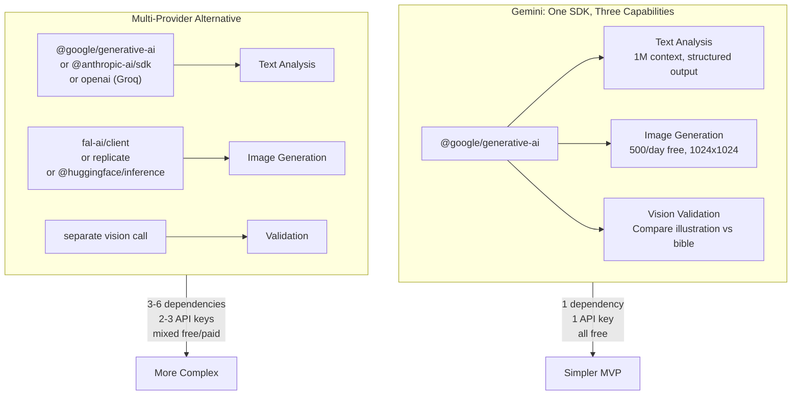

# AI Model Research — Illustrated Book Generator

> Research compiled March 2026. Free tier availability and limits may change.
>
> **Decision: Gemini-only for MVP.** See [decisions.md](./decisions.md) for rationale.

## Can Claude Do It All?

**Short answer: Claude handles all TEXT operations, but CANNOT generate images.**

Claude excels at chapter splitting, scene extraction, character bible creation, and prompt engineering for image generators. However, Anthropic has not built a native image generation model into Claude. A separate image generation service is required.

| Operation | Claude? | Free Alternative | Chosen for MVP |
|---|---|---|---|
| Split book into chapters | Yes | Gemini 2.5 Flash | **Gemini Flash** |
| Extract key scenes | Yes | Gemini 2.5 Flash | **Gemini Flash** |
| Build character/style bible | Yes | Gemini 2.5 Flash | **Gemini Flash** |
| Generate illustration prompts | Yes | Gemini 2.5 Flash | **Gemini Flash** |
| Generate images | **No** | Gemini Flash Image | **Gemini Flash Image** |
| Validate illustrations (vision) | Yes | Gemini 2.5 Flash | **Gemini Flash** |
| Assemble HTML output | N/A (code) | N/A (code) | TypeScript code |

---

## Chosen: Google Gemini 2.5 Flash — `FREE`

The single AI provider for the MVP, handling text analysis, image generation, and vision validation.

**Text capabilities:** 1M token context window — can ingest entire books in a single call. Structured output with JSON mode. ~500 RPD on the free API tier. No credit card required.

**Image capabilities:** Gemini Flash Image generates up to **500 images/day free** at 1024x1024. Same SDK, same API key. Supports multimodal prompts — anchor character images can be passed alongside text prompts for consistency.

**Vision capabilities:** Can analyze generated illustrations against the character bible. Included in the same free tier. Enables the validation loop (Layer 5 of consistency strategy).

**Single SDK:** `@google/generative-ai` — one npm package for all three capabilities.

**Limits:** ~500 requests/day. Quotas have been unstable — cut 92% in Dec 2025, restored to ~500 in Feb 2026.

**Source:** [Gemini API Docs](https://ai.google.dev/gemini-api/docs), [Gemini Image API Free Guide](https://blog.laozhang.ai/en/posts/gemini-image-api-free)

---

## Alternatives Evaluated (Deferred to Phase 5)

These providers were researched but deferred to avoid premature abstraction in the MVP.

### Text AI Alternatives

| Provider | Cost | Context | Strengths | Weaknesses |
|---|---|---|---|---|
| Claude (Anthropic) | $3-15/MTok | 200K | Best quality text analysis | Paid only, no image generation |
| Groq (Llama 3.3 70B) | Free | 128K | Fastest inference | Smaller context, no image |
| OpenRouter (free models) | Free | Varies | Multiple model access | Lower quality free models |

**Source:** [Free LLM API Tier List 2026](https://www.mrcomputerscience.com/free-llm-api-tier-list-2026-for-broke-developers/), [Claude Models Overview](https://platform.claude.com/docs/en/about-claude/models/overview)

### Image AI Alternatives

| Provider | Cost | Quality | Consistency | Notes |
|---|---|---|---|---|
| FLUX.2 (fal.ai) | $0.03-0.05/img | Excellent | Best available | Built-in character reference |
| HuggingFace (SDXL) | Free (slow) | Good | Prompt-only | No reference image support |
| Ideogram 3.0 | $0.03/img (API requires $15/mo plan) | Excellent | Good | "Character" feature, but paid |

**Source:** [FLUX.2 Models](https://bfl.ai/flux2), [HuggingFace Diffusers](https://github.com/huggingface/diffusers), [Ideogram API Pricing](https://ideogram.ai/features/api-pricing)

---

## Why Gemini-Only for MVP

The multi-provider approach adds value only when there's a real need for provider switching. That need will emerge in Phase 5 when premium providers are added. Building the abstraction now would be premature.
