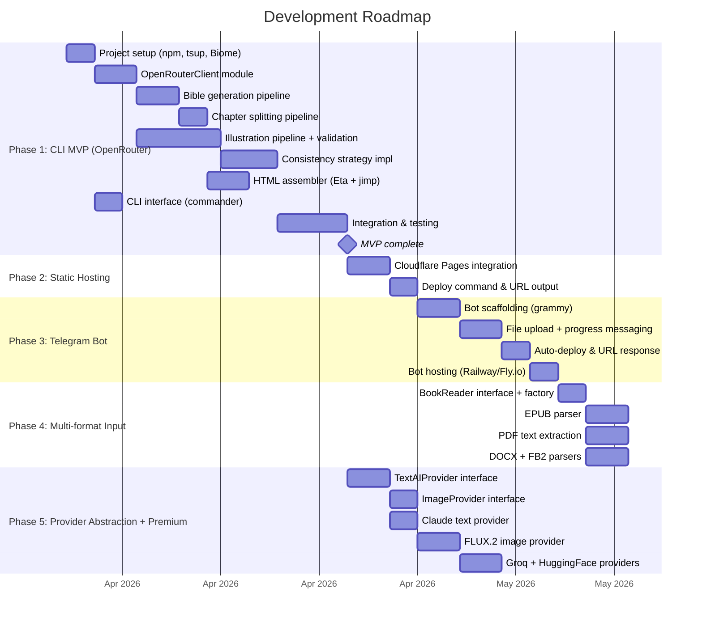
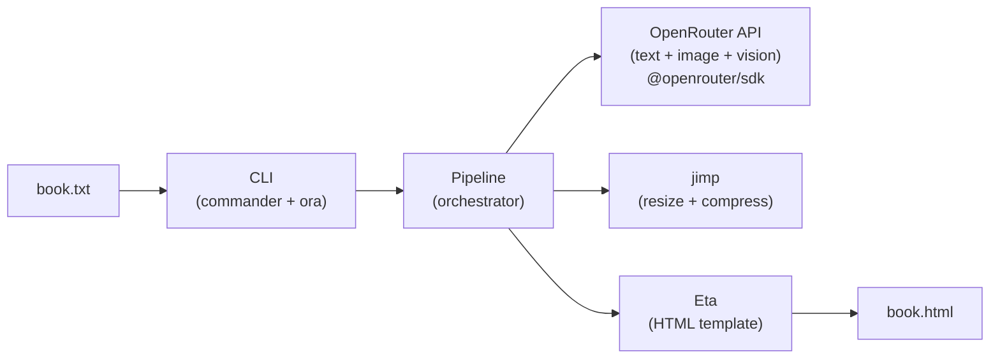
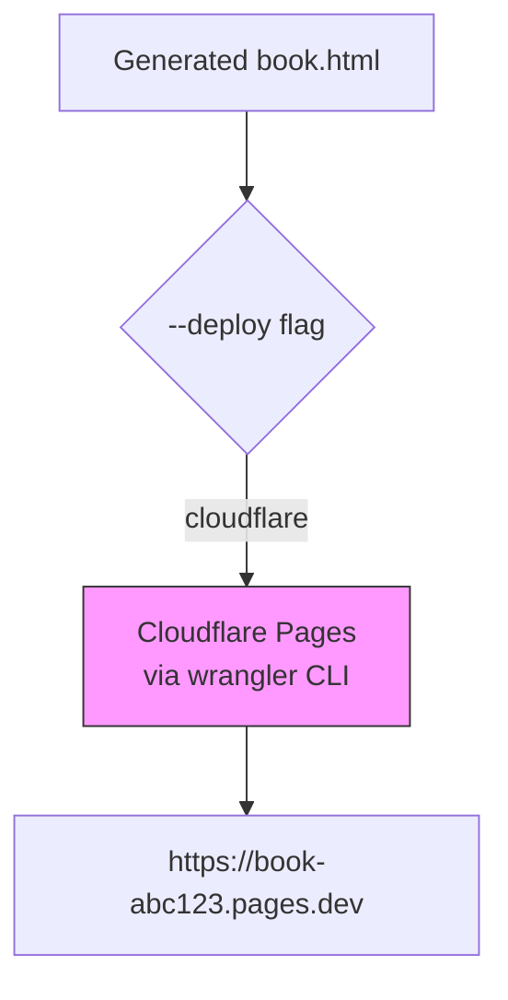
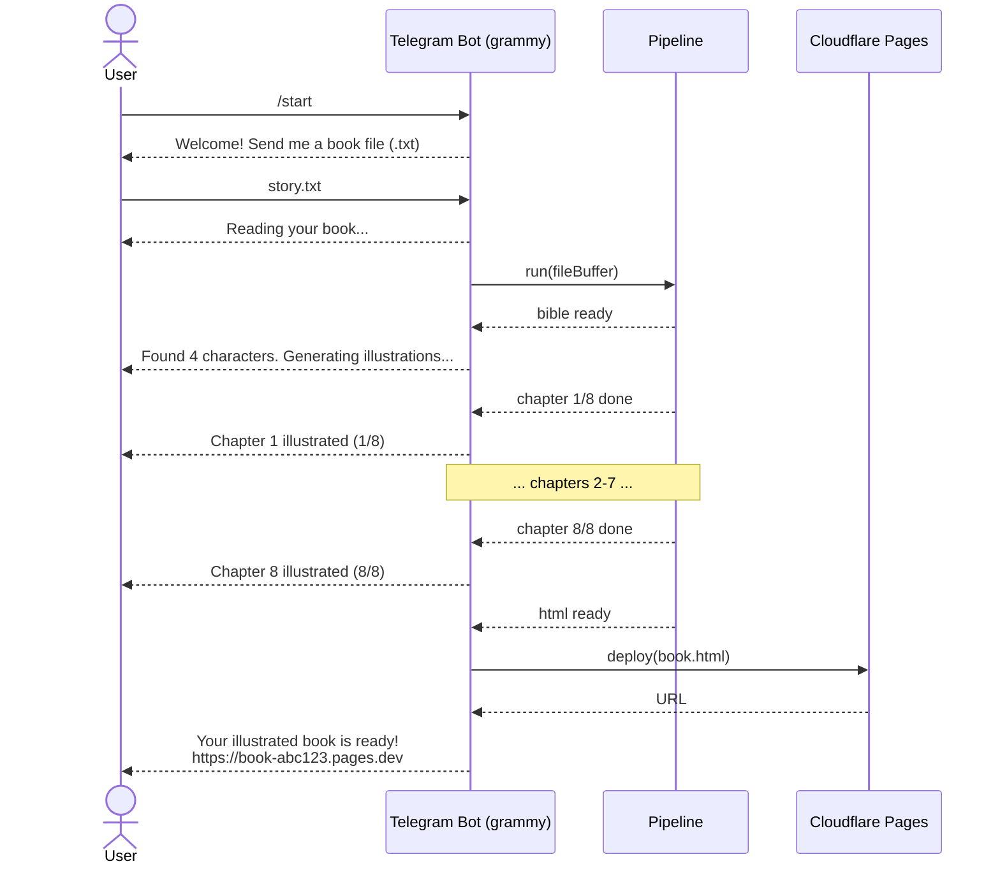
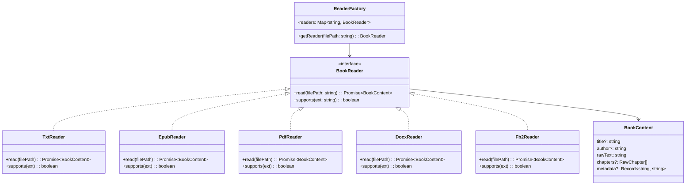
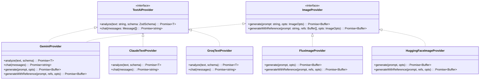

# Feature Roadmap — Illustrated Book Generator

> See [decisions.md](./decisions.md) for all accepted technology choices.

## Phases Overview



---

## Phase 1: CLI MVP (OpenRouter)

The minimum viable product: a CLI tool that takes a `.txt` file and produces an illustrated HTML book via OpenRouter. No provider abstraction — direct OpenRouter SDK integration.

### Deliverables

| # | Feature | Description | Priority |
|---|---|---|---|
| 1.1 | Project scaffolding | TypeScript, tsup, npm, commander, Biome | Must |
| 1.2 | OpenRouterClient module | Single module wrapping all AI operations via OpenRouter (text, image, vision) | Must |
| 1.3 | Book reader (.txt) | Read and normalize text files | Must |
| 1.4 | Bible generator | Analyze text → character sheets + style guide (zod schemas) | Must |
| 1.5 | Chapter splitter | Detect and split chapters via OpenRouter | Must |
| 1.6 | Illustrator pipeline | Key scene → prompt → image (parallel with p-map) | Must |
| 1.7 | Consistency engine | Anchor images, prompt templates, multimodal refs via OpenRouter | Must |
| 1.8 | Image validation | Vision validates each illustration vs bible via OpenRouter (default ON) | Must |
| 1.9 | HTML assembler | Eta template → self-contained HTML with ToC + base64 images | Must |
| 1.10 | Image optimization | jimp resize/compress before embedding | Must |
| 1.11 | CLI interface | commander-based CLI with flags and ora progress output | Must |
| 1.12 | Caching | Cache intermediate results (bible, chapters) for retries | Should |
| 1.13 | Error handling | Graceful degradation, retry logic, rate limit handling | Must |

### Architecture for Phase 1



### npm Scripts

```json
{
  "scripts": {
    "dev": "tsx src/index.ts",
    "build": "tsup src/index.ts --format esm --dts",
    "lint": "biome check .",
    "lint:fix": "biome check --write .",
    "format": "biome format --write .",
    "typecheck": "tsc --noEmit"
  }
}
```

---

## Phase 2: Static Hosting Deployment

After generating the HTML bundle, automatically deploy it to a free static host and return a public URL.

### Hosting Decision



| Host | Free Tier | Deployment Method | Status |
|---|---|---|---|
| **Cloudflare Pages** | Unlimited sites, 500 builds/month | `wrangler pages deploy` | **Primary** |
| Vercel | 100 deploys/day | `vercel deploy --prod` | Future option |
| Netlify | 300 build minutes/month | `netlify deploy --prod` | Future option |

Cloudflare Pages is the primary deployment target. Single file upload (the HTML bundle) requires no build process. Additional hosts can be added later.

### CLI Extension

```
$ bookillust generate -i book.txt --deploy
  ✓ Book generated: output/book.html
  ✓ Deployed to: https://book-abc123.pages.dev
```

---

## Phase 3: Telegram Bot

Wrap the same pipeline with a Telegram bot frontend so users can send a book file and receive an illustrated version.

### Bot Flow



### Tech Choices

| Component | Library | Notes |
|---|---|---|
| Bot framework | `grammy` | Modern, TypeScript-first Telegram bot framework |
| File handling | grammy file plugin | Download uploaded documents |
| Hosting | Railway or Fly.io | Free tiers for always-on bot process |
| Webhook vs polling | Webhook (prod), polling (dev) | Webhook is more efficient |

---

## Phase 4: Multi-format Input Support

Support additional book file formats beyond `.txt`.

### Reader Architecture



| Format | Extension | Library | Priority | Notes |
|---|---|---|---|---|
| Plain text | `.txt` | built-in `fs` | MVP | Already implemented. |
| EPUB | `.epub` | `epub2` or `epubjs` | First | Most common ebook format. Has chapters. |
| PDF | `.pdf` | `pdf-parse` / `pdfjs-dist` | Last | Text extraction quality varies. Hardest. |
| Word | `.docx` | `mammoth` | Second | Structured XML. Good heading detection. |
| FB2 | `.fb2` | `fast-xml-parser` | Second | XML-based. Popular in CIS region. |

---

## Phase 5: Provider Abstraction + Premium

Introduce the provider interface pattern and add alternative AI providers. This is the phase where the abstraction layer from the original design gets built — when there's a real need for it.

### Provider Architecture



### CLI Extension (Phase 5)

```
$ bookillust generate -i story.txt --text-provider claude --image-provider flux
```

### New Environment Variables (Phase 5)

```
ANTHROPIC_API_KEY=        # Claude API key (paid)
GROQ_API_KEY=             # Groq API key (free)
FAL_KEY=                  # fal.ai API key for FLUX.2
HF_TOKEN=                 # Hugging Face API token (free)
```

---

## Risk-Adjusted Timeline Estimate

| Phase | Optimistic | Realistic | Pessimistic |
|---|---|---|---|
| Phase 1: CLI MVP (OpenRouter) | 2 weeks | 4 weeks | 6 weeks |
| Phase 2: Static Hosting | 2 days | 4 days | 1 week |
| Phase 3: Telegram Bot | 1 week | 2 weeks | 3 weeks |
| Phase 4: Multi-format | 1 week | 2 weeks | 3 weeks |
| Phase 5: Provider Abstraction | 1 week | 2 weeks | 3 weeks |

Phase 1 is faster than the original estimate (was 3-5-8 weeks) because there's no provider abstraction to build. The main risk factor remains the consistency engine — achieving acceptable character consistency requires experimentation and prompt iteration.
